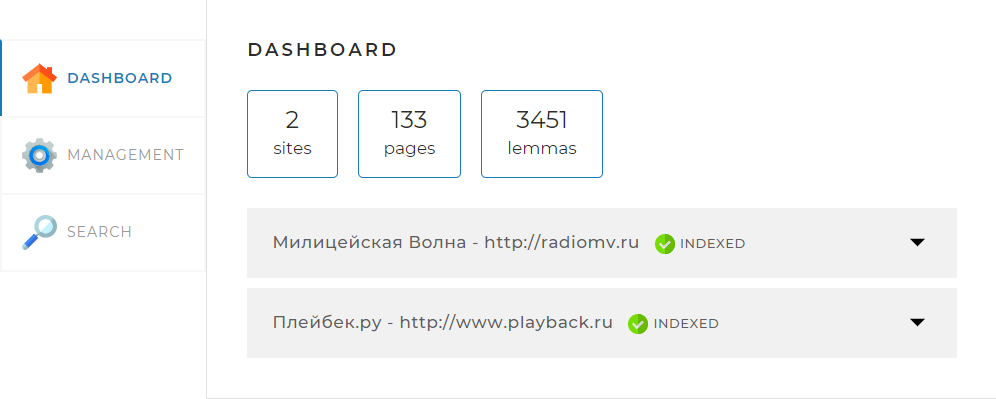
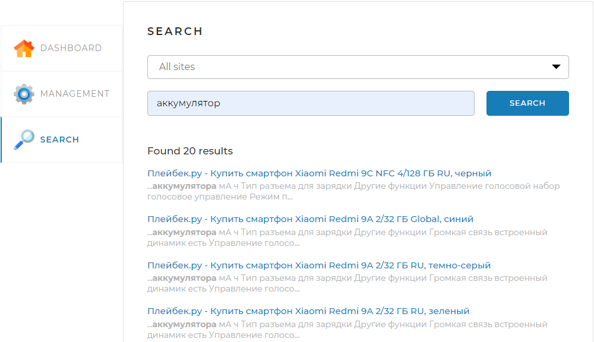

# Search Engine


____
:grey_exclamation: _Java v1.8.0_322_

 :page_facing_up: _Stack_:
SpringBoot,
JDBC,
Hibernate,
JSOUP,
SQL,
Morphology Library,
Lombok.

__SpringBoot app Search engine scan the sites given in application.yml file using ForkJoinPool,
collect text from html files and extracts lemmas from it using morphology library and store in MySQL database
RestControllers provides interface to search pages by query request,application calculates relevancy  and return sorted pages with small snippet of text where words occur._
_API also provides opportunity to set limit of the results, offset the results and choose specific website.__


____
 ```yaml
sites :
    url: http://www.playback.ru, http://radiomv.ru
    name: Плейбек.ру, Милицейская Волна
```

```java
public class SiteController {
    @GetMapping(value = "/startIndexing")
    public ResponseEntity<String> startIndexing() 
    {
        return managementCommands.startIndexing();
    }

}
public class PageController{
    @GetMapping("/search")
    public ResponseEntity<?> search(@RequestParam(name = "query") String query) 
    {
        return searchCommands.search(query,site,limit,offset);
    }

}
```
____
:one: :bar_chart: Statistics method returns info about indexed sites to the dashboard.

____

:two: :computer: Management section used to **start/stop** indexing or to **index/reindex specific webpage**, but page have to be related to sites given in application.yml. 

____

Application calculates webpage relevancy based on the search query: word frequency + in which HTML field they occur.
You can also set which **HTML field** is more relevant to user by changing the field _weight_
```yaml
fieldweight: 1,0.8f,0.6f,0.4f
```
```java
public class HTMLDataFilter 
{
 switch(fieldTag)
    {
        case ("head"):
            weight = fieldWeights[0];
            break;
        case ("body"):
            weight = fieldWeights[1];
            break;
        case ("div"):
            weight = fieldWeights[2];
            break;
        default:
            weight = fieldWeights[3];
            break;
    }
}
```
____
:three:  The **search results** looks likes this:


